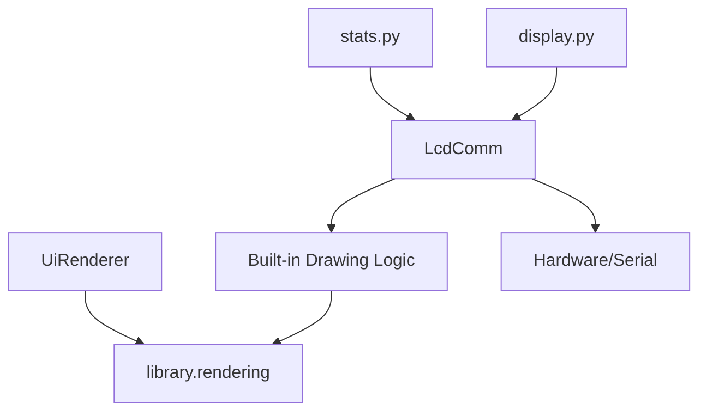
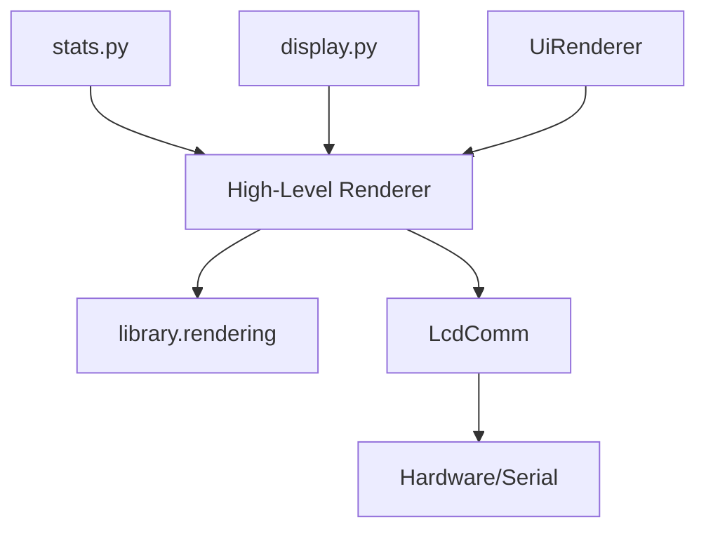

# Design: Drawing Logic Unification

## Architecture Overview
The goal is to separate hardware communication (the "Driver" layer) from the visual presentation (the "Rendering" layer).

### Current State (High Coupling)

### Target State (Decoupled)

## Key Components

### 1. `library.rendering.draw` (Orchestration Layer)
This new module will provide high-level APIs that take an `Image` object (canvas) and drawing parameters. It will handle:
- Color parsing/normalization.
- Background compositing (if requested).
- Text rendering (via `rendering.text`).
- Graphs/Bars rendering (via `rendering.graphs`).
- Applying effects (via `rendering.effects`).

### 2. `LcdComm` (Hardware Driver)
Existing high-level methods will be refactored to:
1. Create a temporary PIL `Image` canvas (if needed).
2. Call `library.rendering.draw` functions to render content onto the canvas.
3. Call `self.DisplayPILImage()` to send the result to hardware.

### 3. `UiRenderer` (Theme Engine)
Will be updated to use `library.rendering.draw` (specifically for text and icons) for unified behavior and to reduce logic duplication.

## Trade-offs
- **Complexity**: Adds a new layer of abstraction. 
  - *Justification*: Improves maintainability and ensures visual parity between different usage paths (direct API, themes, GUI preview).
- **Redundancy removal**: We will remove legacy code in `LcdComm` that manually handles things like `shadow` or `outline` for text, as `library.rendering.text` and `effects` already handle this better.
